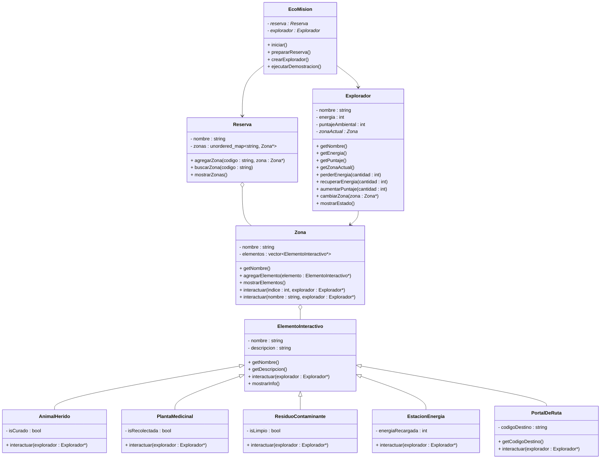
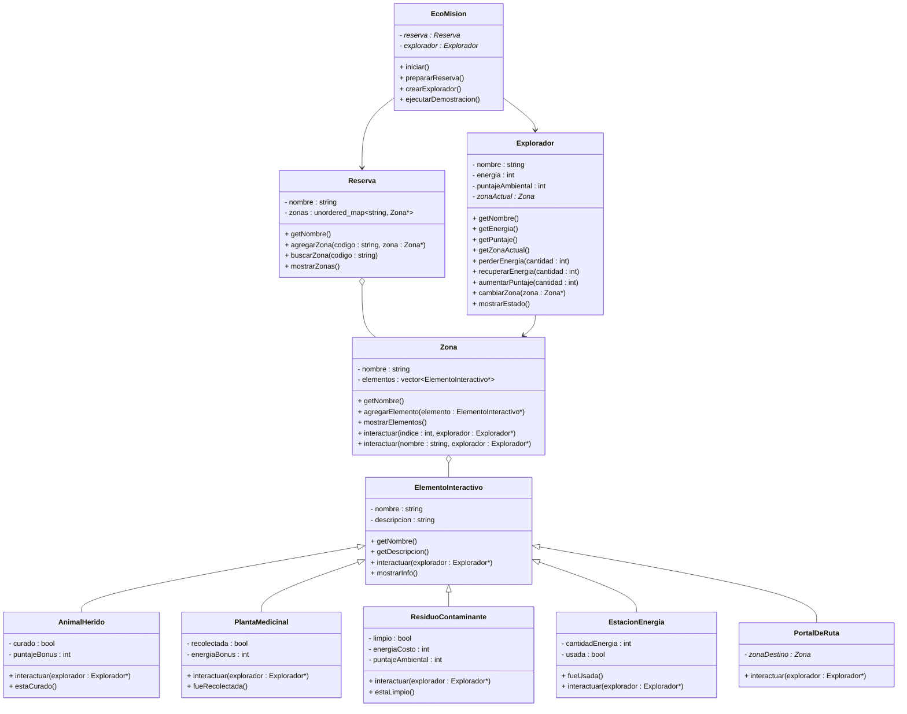
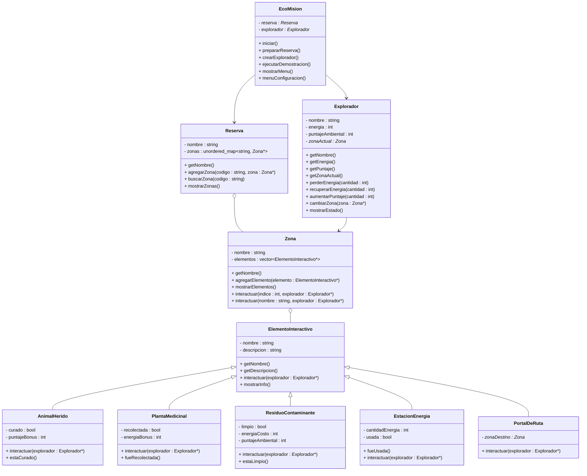

# EcoMisión — Evolución del Diagrama UML y Matriz de Decisiones

---

## Versión Inicial del UML

> Diagrama base con las clases principales y sus relaciones fundamentales, antes de comenzar a programar.

---

## Versión Ajustada del UML

> Diagrama actualizado después de comenzar a programar, con los ajustes que surgieron al implementar las clases.

### ¿Qué cambió?

- Se agregaron nuevos métodos y atributos a las clases que heredan de `ElementoInteractivo`, como el bonus de los puntajes ambientales y energía, y los booleanos de estado.
- Se modificó en `PortalDeRuta` cómo se cambiaba de zona: antes tenía solo el código de destino (`codigoDestino : string`) y le daba la responsabilidad a `EcoMision`. Esto no era correcto, por lo que se actualizó colocando el puntero a `Zona*` directamente para que el mismo elemento haga su trabajo.

---

## Versión Final del UML

> Diagrama definitivo con todas las clases, atributos, métodos y relaciones del sistema completo.

### ¿Qué cambió?

- El único cambio en el final fue agregar dos métodos a `EcoMision` para mostrar el menú del programa: `mostrarMenu()` para el menú general y `menuConfiguracion()` para la configuración personal. Esto con el fin de que el código sea mucho más limpio y el `main` quede muy corto.

---

## Matriz de Decisiones

---
| **Decisión** | **Alternativas consideradas** | **Decisión final** | **Justificación** | **Riesgo si se modela mal** |
|---|---|---|---|---|
| Cómo representar las zonas | `vector`, `matriz`, `unordered_map` | `unordered_map<string, Zona*>` | La reserva busca zonas por código como `"bosque"` o `"rio"` | Se complica la búsqueda o se mezcla con lógica de tablero |
| Cómo representar los elementos dentro de una zona | `unordered_map`, `vector`, arreglo estático | `vector<ElementoInteractivo*>` | Los elementos se recorren en orden, se muestran por índice y no se buscan por clave | Si se usa mapa, se perdería el orden e índice numérico que usa el menú |
| Cómo manejar los diferentes tipos de elementos | Clases separadas sin relación, `switch` por tipo de elemento, herencia | Herencia desde `ElementoInteractivo` (clase abstracta) | Las clases hijas comparten `nombre`, `descripcion` y el método `interactuar()`, cambiando solo el comportamiento | Sin herencia, habría código duplicado y no se podría usar polimorfismo en `Zona` |
| Dónde ejecutar `interactuar()` sobre un elemento | En `EcoMision`, en `Explorador`, en `Zona` | En `Zona` | La zona contiene los elementos y es quien sabe cuál hay en cada posición o con qué nombre | Si lo maneja `EcoMision` directamente, rompe encapsulamiento y la zona pierde su responsabilidad |
| Cómo buscar/activar un elemento dentro de la zona | Solo por índice, solo por nombre, las dos opciones | Sobrecarga de `interactuar()`: una versión por índice (`int`) y otra por nombre (`string`) | Permite dos formas naturales de acceso sin duplicar lógica interna | Sin sobrecarga, se necesitaría un solo método con lógica condicional más difícil de leer |
| Cómo representar la relación Explorador–Zona | El explorador guarda una copia de la zona, guarda un puntero, la zona guarda al explorador | `Explorador` tiene un `Zona*` (puntero, asociación) | El explorador *visita* zonas pero no las posee; la zona existe independientemente del explorador | Si el explorador guarda copia, los cambios en la zona no se reflejan; si la zona guarda al explorador, se mezclan responsabilidades |
| Quién libera la memoria de los elementos | `Zona`, `Reserva`, `EcoMision`, el programador manualmente | El destructor de `Zona` libera sus elementos; el destructor de `Reserva` libera sus zonas | Cada clase libera lo que creó con `new`, siguiendo el principio de responsabilidad | Si `EcoMision` libera todo manualmente se pueden hacer dobles `delete` o fugas de memoria |
| Cómo navegar entre zonas | El explorador conoce todas las zonas, hay un portal como elemento interactivo, el menú cambia la zona directamente | `PortalDeRuta` como subclase de `ElementoInteractivo` que guarda un `Zona*` destino, y también opción en el menú | El portal es un elemento más de la zona, lo que mantiene consistencia con el polimorfismo; el menú lo complementa | Si solo el menú navega, el portal pierde sentido como elemento interactivo del juego |
| Cómo separar la lógica del juego del `main` | Todo en `main`, todo en `EcoMision`, dividir en funciones libres | Clase `EcoMision` controla todo con sus métodos, y main queda más corto | `main` queda limpio con una sola llamada a `iniciar()`; cada responsabilidad tiene su método | Si todo está en `main`, lo sobrecargariamos y el código seria mas dificl de manejar, además no habría encapsulamiento |
| Qué tan configurable es la reserva para el usuario | Todo predeterminado, todo configurable, configuración opcional | `prepararReserva()` carga datos por defecto; `menuConfiguracion()` permite personalizar nombre, zonas y explorador | Equilibra facilidad de prueba con flexibilidad; los elementos siguen siendo predeterminados por diseño para evitar confusiones| Si no hay datos por defecto, el juego no funciona sin que el usuario configure todo manualmente primero |
---